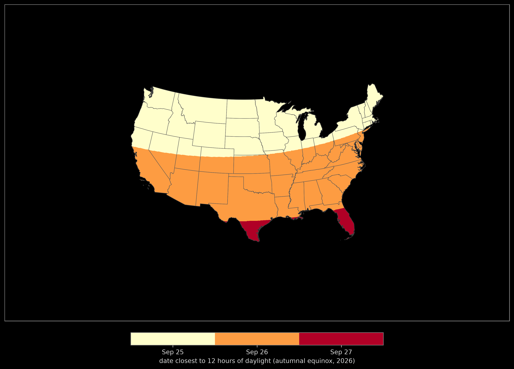

# Equilux Map



Generates a map of the contiguous United States showing, as bands of color, the calendar
date on which each location's length of day is *closest* to 12 hours of sunlight
(sunrise to sunset) - near a given equinox. Day length depends on latitude (and, more
subtly, on local time), so the result is a handful of solid horizontal-ish bands rather
than a smooth gradient: that's the correct picture, not a resolution limitation, since
the "closest date" is inherently a whole-day quantity.

- Computes the equilux date astronomically with [Skyfield](https://rhodesmill.org/skyfield/),
  for either the vernal or autumnal equinox, for any year
- Renders the result as a colored heatmap over the lower 48 states, with state and
  national borders drawn on top
- Adaptively refines the sample grid near the date-transition lines so those boundaries
  are drawn accurately without the cost of full-resolution sampling everywhere else
- Coastlines are rendered at full shapefile precision regardless of sample resolution
- Disk-caches astronomical calculations so repeated runs are fast

## Requirements

- Python 3.11+
- Dependencies listed in `requirements.txt` / `pyproject.toml` (geopandas, matplotlib,
  numpy, pyproj, shapely, skyfield, tqdm, mezmorize)
- Download US Census Bureau state shapefiles and place them in `data/cb_2022_us_all_500k/` available [here](https://www2.census.gov/geo/tiger/GENZ2022/shp/).

## Usage

```
python equilux_map.py [--year YEAR] [--equinox {Vernal,Autumnal}]
                       [--step STEP] [--refine-step REFINE_STEP]
                       [--lon-refine-step LON_REFINE_STEP]
```

With no arguments, it maps whichever equinox (vernal or autumnal) is closest to
today's date, at sensible default resolution. `--step` is the base sample spacing
in degrees; `--refine-step` and `--lon-refine-step` control how finely that's
resampled near the date-transition lines specifically. See `--help` for the full
list of options and their defaults.

## Output

The generated map is saved as `equilux_map_<year>_<equinox>_<step>.png` in the project
directory.

## License

MIT License
