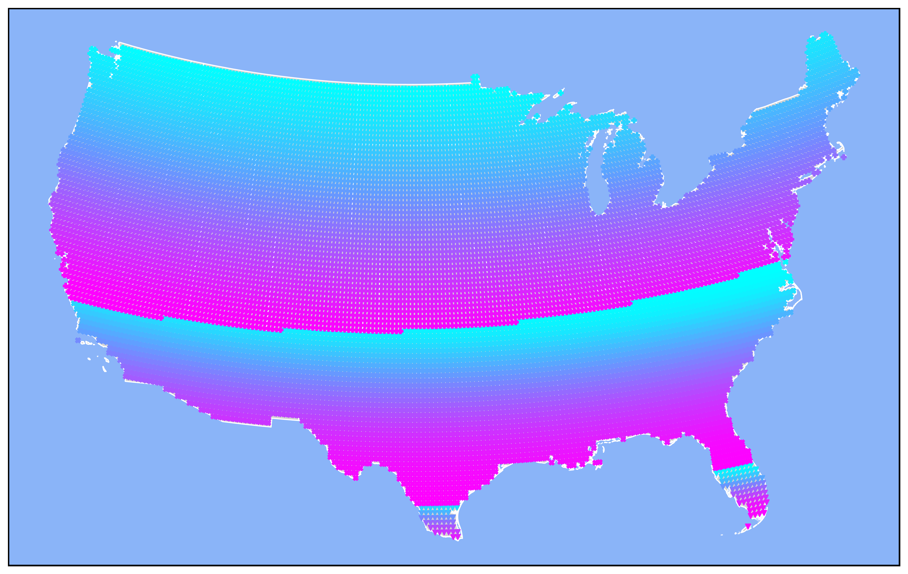

# Equilux Map

This project generates a map of the contiguous United States, plotting data points for the autumnal equilux (the day when day and night are nearly equal) at various locations. The map visualizes the day of equilux for each point, using different markers for each weekday.

## Features

- Plots US states (excluding Alaska, Hawaii, and territories) using shapefiles
- Calculates and displays the autumnal equilux for each location
- Uses caching to speed up repeated calculations
- Customizable map resolution and spacing between data points

## Requirements

- Python 3.7+
- pip

### Python Packages

- `timezonefinder`
- `geopandas`
- `matplotlib`
- `pandas`
- `shapely`
- `tqdm`
- `mezmorize`
- `earliest_latest_sun` (custom or external module)

Install dependencies with:
`pip install -r requirements.txt`

## Data

Download US Census Bureau shapefiles and place them in the `data/cb_2022_us_all_500k/` directory.

## Usage

Run the main script to generate the map:

You can adjust the spacing between points by changing the `step` parameter in the script.

## Output

The generated map will be saved as `equilux_map.png` in the project directory.

## License

MIT License

